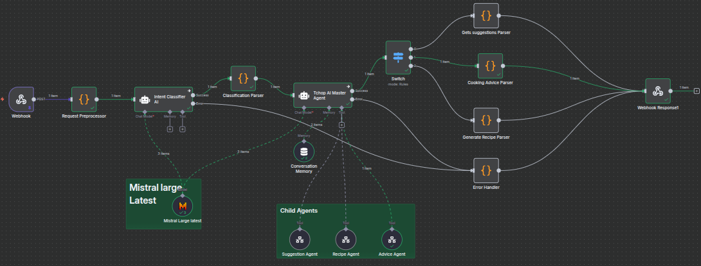
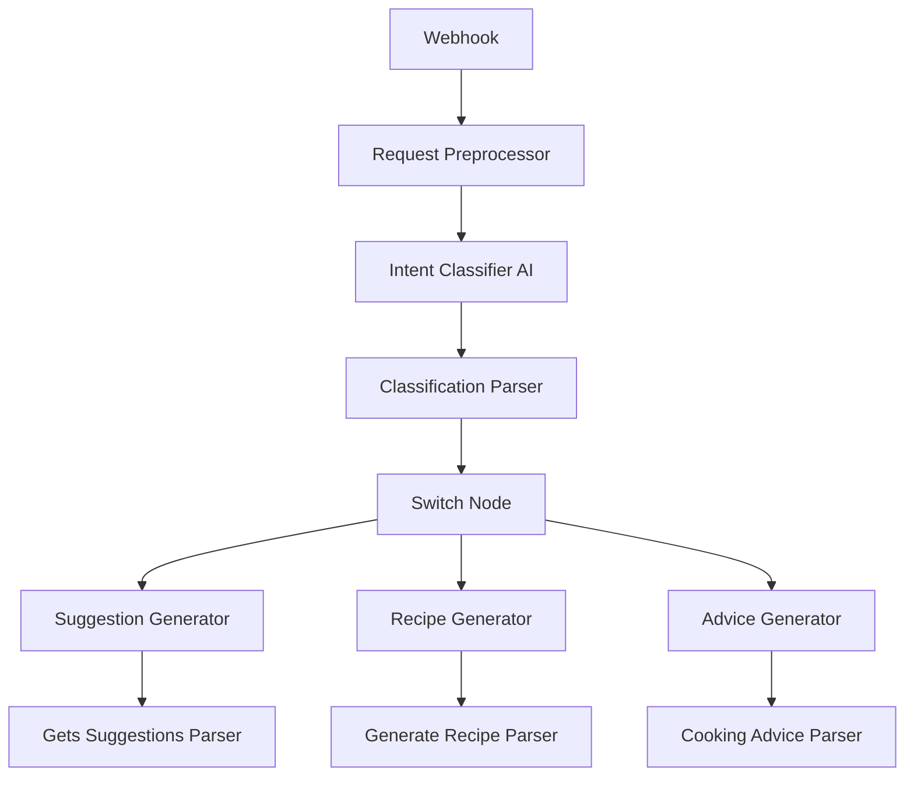

# 🍽️ TchopIA - Assistant Culinaire Camerounais



**TchopIA** est un assistant culinaire intelligent spécialisé dans la cuisine camerounaise. Utilisant l'intelligence artificielle et une architecture de workflows n8n sophistiquée, TchopIA offre des suggestions de plats, des recettes détaillées et des conseils culinaires adaptés aux traditions gastronomiques du Cameroun.

## ✨ Fonctionnalités

### 🎯 **Assistant IA Multifonctionnel**
- **🍲 Suggestions de plats** - Découvrez des plats camerounais basés sur vos ingrédients
- **📖 Recettes détaillées** - Générez des recettes complètes avec instructions étape par étape
- **💡 Conseils culinaires** - Obtenez des astuces et secrets de cuisine traditionnelle

### 🤖 **Intelligence Artificielle Avancée**
- **Classification intelligente des intentions** - IA qui comprend automatiquement votre demande
- **Parsing multi-méthodes** - Traitement robuste des réponses IA avec gestion des erreurs
- **Génération contextuelle** - Réponses adaptées à la culture culinaire camerounaise

### 🎨 **Interface Utilisateur Moderne**
- **Design responsive** - Interface optimisée pour mobile et desktop
- **États de chargement avancés** - Feedback visuel pour chaque action
- **Navigation intuitive** - Expérience utilisateur fluide et accessible

## 🏗️ Architecture

### **Frontend (Interface Web)**
```
├── index.html              # Page d'accueil principale
├── assets/
│   ├── ia.html             # Interface principale de l'assistant IA
│   ├── genere.html         # Page spécialisée génération de recettes
│   ├── decouvre.html       # Page spécialisée découverte de plats
│   ├── conseil.html        # Page spécialisée conseils culinaires
│   ├── contact.html        # Page de contact
│   ├── css/
│   │   └── index.css       # Styles principaux
│   ├── js/
│   │   ├── tchopia-ai-enhanced.js    # Logic principale IA
│   │   ├── tchopia-recipe.js         # Logic génération recettes
│   │   ├── tchopia-discovery.js      # Logic découverte plats
│   │   └── tchopia-advice.js         # Logic conseils culinaires
│   └── img/                # Images et assets visuels
```

### **Backend (Workflows n8n)**
```
├── n8n-workflows/
│   ├── tchopia-ai-workflow.json      # Workflow principal avec IA
│   ├── suggestion_generator.json     # Sous-workflow suggestions
│   ├── recipe_generator.json         # Sous-workflow recettes
│   └── advice_generator.json         # Sous-workflow conseils
```

## 🚀 Installation et Configuration

### **Prérequis**
- **n8n** (version 1.0+) installé et configuré
- **Accès à une API LLM** (Groq, OpenAI, etc.)
- **Serveur web** pour héberger le frontend
- **Node.js** (pour n8n)

### **1. Configuration n8n**

#### **Installation des Workflows**
```bash
# Importer les workflows dans n8n
# Via l'interface n8n: Settings → Import from file
1. tchopia-ai-workflow.json      # Workflow principal
2. suggestion_generator.json     # Suggestions de plats  
3. recipe_generator.json         # Génération de recettes
4. advice_generator.json         # Conseils culinaires
```

#### **Configuration des Credentials**
```bash
# Dans n8n, configurez:
1. Groq API → Ajoutez votre clé API Groq
2. Webhook URLs → Configurez l'endpoint principal
   URL: http://localhost:5678/webhook/tchopia-ai
```

#### **Activation des Workflows**
```bash
# Activez tous les workflows dans cet ordre:
1. suggestion_generator (sous-workflow)
2. recipe_generator (sous-workflow)  
3. advice_generator (sous-workflow)
4. tchopia-ai-workflow (workflow principal)
```

### **2. Configuration Frontend**

#### **Variables de Configuration**
Modifiez le fichier `assets/js/tchopia-ai-enhanced.js`:

```javascript
// Configuration n8n
const N8N_WEBHOOK_URL = 'http://localhost:5678/webhook/tchopia-ai';

// Modifiez selon votre configuration:
// - Production: 'https://votre-domaine.com/webhook/tchopia-ai'
// - Développement: 'http://localhost:5678/webhook/tchopia-ai'
```

#### **Serveur Web**
```bash
# Option 1: Serveur Python simple
cd /path/to/TchopIA
python -m http.server 8000

# Option 2: Live Server (VS Code)
# Installez l'extension Live Server et clic droit → "Open with Live Server"

# Option 3: Nginx/Apache
# Configurez votre serveur web pour servir les fichiers statiques
```

## 🔧 Utilisation

### **Interface Principale (`ia.html`)**

#### **Fonctionnement Général**
1. **Saisie de requête** - L'utilisateur entre sa demande dans le champ texte
2. **Classification IA** - Le système détermine automatiquement le type d'action
3. **Traitement spécialisé** - Redirection vers le sous-workflow approprié
4. **Affichage des résultats** - Présentation des suggestions/recettes/conseils

#### **Types de Requêtes Supportées**
```javascript
// Suggestions de plats
"Que puis-je cuisiner avec du poisson et des épinards ?"
"Plats camerounais avec arachides"

// Recettes détaillées  
"Comment préparer le ndolé ?"
"Recette du poulet DG"

// Conseils culinaires
"Comment éviter que mon ndolé soit trop amer ?"
"Astuces pour bien cuisiner le poisson braisé"
```

### **Pages Spécialisées**

#### **Génération de Recettes (`genere.html`)**
- Interface dédiée à la création de recettes détaillées
- Formulaire spécialisé avec champs pour ingrédients et préférences
- Génération de recettes complètes avec temps de cuisson et difficulté

#### **Découverte de Plats (`decouvre.html`)**
- Exploration de la cuisine camerounaise par région
- Suggestions basées sur les ingrédients disponibles
- Présentation avec images et contexte culturel

#### **Conseils Culinaires (`conseil.html`)**
- Interface pour obtenir des conseils spécialisés
- Catégorisation automatique (technique, ingrédients, problèmes)
- Conseils traditionnels et astuces de grand-mères

## 🤖 Workflows n8n Détaillés

### **Workflow Principal** (`tchopia-ai-workflow.json`)

#### **Architecture:**


#### **Composants Clés:**
- **Intent Classifier AI** - Classification automatique des demandes
- **Switch Node** - Routage intelligent vers les sous-workflows
- **Parsers Enhanced** - Traitement robuste avec gestion des erreurs

### **Sous-Workflows**

#### **1. Suggestion Generator** (`suggestion_generator.json`)
```javascript
// Entrée: Ingrédients ou préférences
// Sortie: Liste de 5 suggestions avec métadonnées
{
  "suggestions": [
    {
      "name": "Ndolé",
      "description": "Plat traditionnel aux arachides et feuilles amères",
      "region": "Centre",
      "difficulty": "Intermédiaire",
      "prep_time": "45 minutes"
    }
  ]
}
```

#### **2. Recipe Generator** (`recipe_generator.json`)
```javascript
// Entrée: Nom du plat
// Sortie: Recette complète
{
  "recipe": {
    "name": "Ndolé Traditionnel",
    "ingredients": [...],
    "instructions": [...],
    "cooking_time": "1h30",
    "difficulty": "Intermédiaire"
  }
}
```

#### **3. Advice Generator** (`advice_generator.json`)
```javascript
// Entrée: Question/problème culinaire
// Sortie: Conseils structurés
{
  "advice": {
    "advice_type": "Technique",
    "main_advice": "...",
    "quick_tips": [...],
    "traditional_secrets": [...],
    "common_mistakes": [...]
  }
}
```

## 🎨 Interface Utilisateur

### **États de Chargement Avancés**

#### **Chargement Individuel des Boutons**
- Chaque bouton "Voir la recette" et "Conseils" a son propre état de chargement
- Animation spinner SVG avec texte "Génération..."
- Désactivation du bouton pendant le traitement

#### **Overlays de Chargement**
- **Génération de recettes** - Modal plein écran avec barre de progression
- **Conseils culinaires** - État de chargement amélioré avec message contextualized

#### **Notifications de Succès/Erreur**
- Messages de succès auto-disparaissant après 3 secondes
- Gestion d'erreurs avec possibilité de réessayer
- Feedback visuel pour toutes les actions

### **Responsive Design**
```css
/* Mobile First Approach */
@media (max-width: 768px) {
  /* Optimisations mobile */
}

@media (min-width: 769px) {
  /* Optimisations desktop */
}
```

## 📊 Gestion des Erreurs

### **Frontend**
```javascript
// Gestion des erreurs réseau
catch (error) {
  console.error('Erreur:', error);
  showError('Erreur de connexion. Vérifiez votre serveur n8n.');
}

// Gestion des réponses invalides
if (!data.success) {
  handleErrorResponse(data);
}
```

### **Backend (n8n)**
```javascript
// Parsing avec fallbacks multiples
// Méthode 1: JSON direct
// Méthode 2: Extraction de patterns
// Méthode 3: Parsing de markdown
// Méthode 4: Extraction de texte structuré
// Méthode 5: Fallback avec contenu par défaut
```

## 🔒 Sécurité

### **Validation des Entrées**
- Sanitisation des données utilisateur
- Validation des formats de réponse IA
- Protection contre les injections

### **Gestion des Sessions**
- ID de session unique pour chaque utilisateur
- Stockage local des préférences
- Nettoyage automatique des données sensibles

## 🚀 Déploiement

### **Environnement de Développement**
```bash
# 1. Cloner le repository
git clone https://github.com/votre-repo/TchopIA.git

# 2. Configurer n8n
docker run -p 5678:5678 n8nio/n8n

# 3. Importer les workflows
# Via interface n8n

# 4. Lancer le serveur web
python -m http.server 8000
```

### **Production**
```bash
# 1. Configuration n8n en production
# - Utiliser une base de données PostgreSQL
# - Configurer HTTPS
# - Sécuriser les webhooks

# 2. Hébergement frontend
# - Nginx/Apache pour servir les fichiers statiques
# - CDN pour les assets
# - Certificat SSL

# 3. Monitoring
# - Logs n8n
# - Métriques de performance
# - Alertes d'erreur
```

## 📈 Performance

### **Optimisations Frontend**
- **Lazy loading** des images
- **Minification** CSS/JS en production
- **Gestion du cache** pour les réponses IA
- **Debouncing** des requêtes utilisateur

### **Optimisations Backend**
- **Mise en cache** des réponses fréquentes
- **Limitation de débit** (rate limiting)
- **Gestion des timeouts** appropriée
- **Retry logic** pour les appels API

## 🐛 Débogage

### **Logs Frontend**
```javascript
// Activation des logs détaillés
console.log('TchopIA Session ID:', sessionId);
console.log('AI Agent Response:', data);
console.log('Parse method:', parseMethod);
```

### **Logs n8n**
- Utilisation des nœuds de logging
- Vérification des webhooks dans l'historique
- Analyse des erreurs de parsing

### **Tests Communs**
```bash
# Test de connectivité n8n
curl -X POST http://localhost:5678/webhook/tchopia-ai \
  -H "Content-Type: application/json" \
  -d '{"query": "test"}'

# Test des workflows individuels
# Via interface n8n: Execute workflow
```

## 🤝 Contribution

### **Structure du Projet**
```
TchopIA/
├── README.md              # Documentation principale
├── index.html            # Page d'accueil
├── assets/               # Interface utilisateur
├── n8n-workflows/        # Workflows backend
└── .gitignore           # Fichiers ignorés
```

### **Conventions de Code**
- **HTML** - Semantic HTML5, accessibilité ARIA
- **CSS** - Mobile-first, BEM methodology
- **JavaScript** - ES6+, documentation JSDoc
- **n8n** - Nommage descriptif des nœuds

## 📄 Licence

Ce projet est sous licence MIT. Voir le fichier `LICENSE` pour plus de détails.

## 👥 Équipe

### **Contributeurs Principaux**

- **[Dimitri Tedom](https://github.com/DimitriTedom)** - Développement Frontend & Backend
  - Interface utilisateur et intégrations
  - Workflows n8n et logique IA
  - Architecture système et optimisations

- **[Danielle](https://github.com/Danielle2814)** - Design & Développement
  - Expérience utilisateur et design responsive
  - Interface culinaire spécialisée
  - Intégration des fonctionnalités IA

### **Domaines d'Expertise**
- **Développement Frontend** - Interface utilisateur moderne et responsive
- **Développement Backend** - Workflows n8n et logique IA avancée
- **Design UX/UI** - Expérience utilisateur optimisée pour la cuisine camerounaise
- **Data & IA** - Optimisation des prompts et parsing intelligent

## 🆘 Support

### **Documentation**
- **Workflows n8n** - Documentation complète dans chaque workflow
- **API Reference** - Exemples de requêtes/réponses
- **Troubleshooting** - Guide de résolution des problèmes courants

### **Contact**
- **Issues GitHub** - Rapports de bugs et demandes de fonctionnalités
- **Email** - support@tchopia.com
- **Documentation** - [Wiki du projet](lien-vers-wiki)

---

**TchopIA** - *Votre assistant culinaire camerounais intelligent* 🇨🇲

Fait avec ❤️ pour préserver et partager la richesse de la cuisine camerounaise.