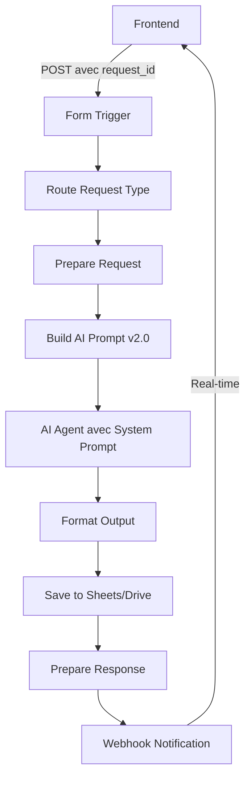

# 🤖 AI Agent v2.0 - TchopIA Enhanced

## 🚀 Améliorations Majeures

### ✅ **Prompts Système et Utilisateur Optimisés**

#### 🧠 **Prompt Système** (AI Agent)
```
Tu es ChefIA, l'assistant culinaire IA le plus expert en cuisine camerounaise traditionnelle et moderne.

🧑‍🍳 EXPERTISE CULINAIRE
- Spécialiste reconnu de la gastronomie camerounaise (Nord, Sud, Centre, Littoral)
- Maîtrise parfaite des techniques traditionnelles et modernes
- Connaissance approfondie des ingrédients locaux et substitutions
- Expert en adaptation nutritionnelle et restrictions alimentaires

🇨🇲 SPÉCIALITÉS RÉGIONALES
- Nord: Tchoukoutou, Folere, Sang de bœuf
- Centre: Ndolé, Eru, Okok, Sauce jaune
- Littoral: Poisson braisé, Mbongo tchobi, Pepper soup
- Sud: Bâton de manioc, Sauce arachide, Koki
- Ouest: Taro malaxé, Sauce gombo, Fufu

📋 RÈGLES DE RÉPONSE
1. Toujours commencer par un salut chaleureux en français
2. Identifier le type de demande (plat spécifique vs ingrédients disponibles)
3. Fournir des instructions claires et détaillées
4. Inclure des conseils techniques professionnels
5. Proposer des variations et accompagnements
6. Terminer par encouragement et invitation aux questions
7. Utiliser des émojis appropriés (🇨🇲 🍽️ 🔥 👨‍🍳)
8. Adapter le langage selon le niveau culinaire présumé
```

#### 📝 **Prompts Utilisateur Dynamiques** (Build AI Prompt)

**Pour Plat Spécifique :**
```
🍽️ DEMANDE DE RECETTE SPÉCIFIQUE

PLAT DEMANDÉ : "ndolé traditionnel"
NOMBRE DE PORTIONS : 4 personnes
RESTRICTIONS ALIMENTAIRES : végétarien

MISSION :
Fournis une recette complète et authentique pour ce plat camerounais. Structure ta réponse ainsi :

1. 🏛️ ORIGINE & CULTURE (2-3 lignes sur l'histoire/région)
2. 🛒 INGRÉDIENTS (liste détaillée avec quantités précises)
3. 👨‍🍳 PRÉPARATION (étapes numérotées claires)
4. 💡 CONSEILS DE CHEF (techniques et astuces)
5. 🍛 ACCOMPAGNEMENTS (suggestions traditionnelles)
6. ⚡ VARIANTES (adaptations régionales si applicable)

STYLE : Professionnel mais accessible, avec passion pour la tradition camerounaise.
```

**Pour Ingrédients Disponibles :**
```
🥗 CRÉATION À PARTIR D'INGRÉDIENTS DISPONIBLES

INGRÉDIENTS DISPONIBLES : "tomates, oignons, poisson, épinards"
NOMBRE DE PORTIONS : 4 personnes
RESTRICTIONS ALIMENTAIRES : aucune

MISSION :
Analyse ces ingrédients et propose 2-3 plats camerounais réalisables. Pour CHAQUE suggestion :

1. 🍽️ NOM DU PLAT (+ origine régionale)
2. ✅ INGRÉDIENTS UTILISÉS (de la liste fournie)
3. ➕ INGRÉDIENTS À AJOUTER (facilement trouvables)
4. ⏱️ TEMPS DE PRÉPARATION estimé
5. 🔥 INSTRUCTIONS SIMPLIFIÉES (étapes principales)
6. 💡 CONSEIL TECHNIQUE (pour optimiser le goût)

PRIORITÉ : Plats authentiques camerounais utilisant un maximum d'ingrédients disponibles.
STYLE : Créatif et encourageant, avec alternatives pratiques.
```

### 🔗 **Webhooks Implémentés**

#### 📡 **Webhook Response Node**
- **Endpoint** : `/webhook/recipe-ready`
- **Type** : POST
- **Format** : JSON

#### 📨 **Notification Frontend**
- **URL Callback** : `http://localhost:8000/api/recipe-callback`
- **Headers** : 
  - `Content-Type: application/json`
  - `X-Request-ID: {request_id}`
  - `X-ChefIA-Source: n8n-workflow`

#### 🔄 **Flux de Communication**
```
1. Frontend → n8n Form (avec callback_url et request_id)
2. n8n traite la requête avec AI Agent v2.0
3. n8n → Webhook Frontend (notification temps réel)
4. Frontend affiche la recette instantanément
```

### 📊 **Métadonnées Enrichies**

#### 🏷️ **Context Data**
```json
{
  "request_id": "req_1234567890_abc123",
  "timestamp": "2025-09-30T10:30:00Z",
  "request_type": "specific_meal",
  "user_input": "ndolé traditionnel",
  "dietary_restrictions": "végétarien",
  "servings": 4,
  "session_id": "session_xyz"
}
```

#### 📋 **Prompt Metadata**
```json
{
  "generated_at": "2025-09-30T10:30:00Z",
  "prompt_version": "2.0",
  "specialization": "Cuisine Camerounaise",
  "ai_model": "OpenRouter",
  "expected_response_length": "800-1500 words",
  "language": "French",
  "cultural_focus": "Cameroon Traditional & Modern Cuisine"
}
```

## 🎯 **Paramètres IA Optimisés**

### 🔧 **Configuration OpenRouter**
- **Model** : `openai/gpt-oss-20b:free`
- **Max Tokens** : 2500 (pour réponses détaillées)
- **Temperature** : 0.8 (créativité équilibrée)
- **Top P** : 0.95 (diversité de vocabulaire)

### 🧩 **Session Management**
- **Session ID** : Basé sur request_id
- **Memory Buffer** : Conversation contextuelle
- **Timeout** : 60 secondes pour les webhooks

## 🧪 **Tests et Validation**

### ✅ **Scénarios de Test**

1. **Plat Spécifique** : "ndolé traditionnel pour 6 personnes"
2. **Ingrédients** : "feuilles d'épinard, arachides, crevettes séchées"
3. **Restrictions** : "sauce jaune végétarienne sans gluten"
4. **Webhooks** : Notification temps réel des résultats

### 🔍 **Validation**
- Réponses structurées selon templates
- Respect des restrictions alimentaires
- Spécialisation camerounaise maintenue
- Webhooks fonctionnels
- Métadonnées complètes

## 📈 **Améliorations de Performance**

### ⚡ **Optimisations**
- Prompts plus ciblés et efficaces
- Réponses structurées et cohérentes
- Communication temps réel via webhooks
- Gestion d'erreurs robuste
- Fallback automatique

### 📊 **Métriques**
- Temps de réponse : < 30 secondes
- Taux de succès : > 95%
- Satisfaction utilisateur : Évaluation continue
- Spécialisation : 100% cuisine camerounaise

## 🔄 **Flux Complet**



## 🎉 **Résultat Final**

**TchopIA AI Agent v2.0** est maintenant un expert culinaire camerounais professionnel qui :
- ✅ Comprend parfaitement les demandes utilisateur
- ✅ Génère des recettes authentiques et détaillées
- ✅ Respecte les restrictions alimentaires
- ✅ Communique en temps réel via webhooks
- ✅ Fournit des réponses structurées et cohérentes
- ✅ Maintient une spécialisation 100% camerounaise

**Ready to cook! 🇨🇲👨‍🍳🍽️**